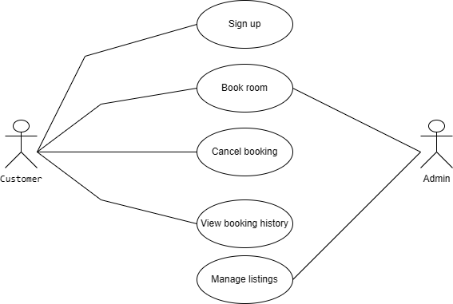

# Requirement Analysis in Software Development

This repository contains the documentation for the requirement analysis phase of a Booking Management System. It is part of the ALX project to practice analyzing and structuring software requirements.

---

## What is Requirement Analysis?

Requirement Analysis is a key phase in the Software Development Life Cycle (SDLC). It involves identifying, gathering, analyzing, and documenting the needs and expectations of users and stakeholders for a software system. The goal is to ensure the final product aligns with business goals and user needs.

It serves as a foundation for all future stages of the project, reducing risks, preventing misunderstandings, and avoiding costly rework.

---

## Why is Requirement Analysis Important?

1. **Reduces Project Risks**  
   It helps avoid miscommunication and ensures that all stakeholders have a shared understanding of the project scope.

2. **Improves Planning and Cost Estimation**  
   Well-defined requirements allow accurate budgeting, resource planning, and scheduling.

3. **Ensures Quality and User Satisfaction**  
   By understanding what users truly need, developers can build systems that are functional, efficient, and user-friendly.

---

## Key Activities in Requirement Analysis

- **Requirement Gathering**: Collecting information from stakeholders, clients, and users.
- **Requirement Elicitation**: Drawing out detailed and specific requirements using interviews, surveys, workshops, etc.
- **Requirement Documentation**: Writing and organizing requirements clearly in technical documents.
- **Requirement Analysis and Modeling**: Structuring and interpreting requirements using diagrams and logical models.
- **Requirement Validation**: Reviewing and confirming requirements with stakeholders to avoid errors or ambiguity.

---

## Types of Requirements

### Functional Requirements

Functional requirements describe **what the system should do**. They define specific features and interactions.

**Examples for Booking System:**
- A user can create an account.
- A user can search for available bookings.
- A user can cancel a reservation.
- Admin can manage listings.

### Non-functional Requirements

Non-functional requirements describe **how the system should behave**. These are qualities, not actions.

**Examples for Booking System:**
- The system should load within 3 seconds.
- The platform must support up to 10,000 users simultaneously.
- The website should be available 99.9% of the time.
- User data must be encrypted and protected.

---

## Use Case Diagrams

Use Case Diagrams are visual representations that show how different users (actors) interact with the system and what actions (use cases) they perform. They help in understanding system scope and user behavior.

📌 **Actors**: Customer, Admin  
📌 **Use Cases**: Sign up, Book room, Cancel booking, View booking history, Manage listings

---

## Acceptance Criteria

Acceptance Criteria are predefined conditions that a software product must meet to be accepted by the client or user. They ensure that a feature works as expected and meets the business needs.

### Example: Checkout Feature

- **Given**: A user has selected a room and filled in their payment details.
- **When**: They click the “Confirm Booking” button.
- **Then**: The booking should be saved, a confirmation message should appear, and an email should be sent to the user.

---
